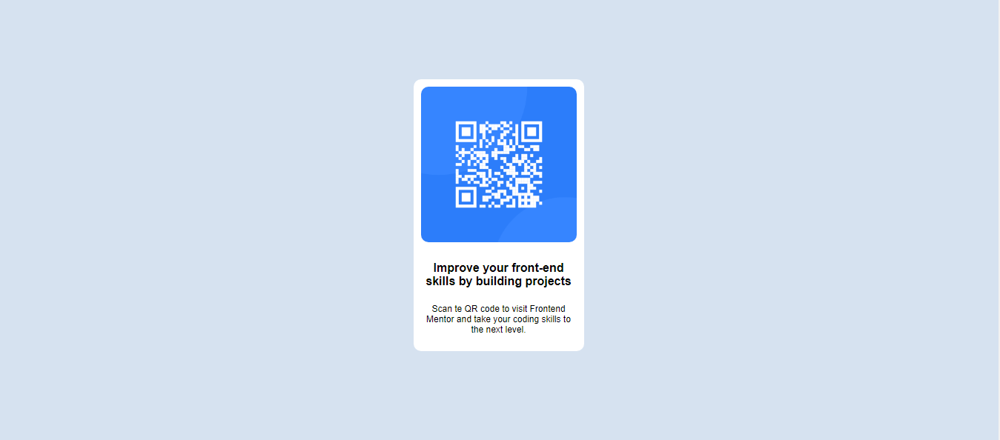

# Frontend Mentor - QR code component solution

This is a solution to the [QR code component challenge on Frontend Mentor](https://www.frontendmentor.io/challenges/qr-code-component-iux_sIO_H). Frontend Mentor challenges help you improve your coding skills by building realistic projects. 

## Table of contents

- [Overview](#overview)
  - [Screenshot](#screenshot)
  - [Links](#links)
- [My process](#my-process)
  - [Built with](#built-with)
  - [What I learned](#what-i-learned)
  - [Continued development](#continued-development)
  - [Useful resources](#useful-resources)
- [Author](#author)
- [Acknowledgments](#acknowledgments)

**Note: Delete this note and update the table of contents based on what sections you keep.**

## Overview

### Screenshot

### Links

- Solution URL: [ solution URL ](https://github.com/bhandwalkardarshan/qr-code-component)
- Live Site URL: [ live site URL ](https://bhandwalkardarshan.github.io/qr-code-component/)

## My process

### Built with

- Semantic HTML5 markup
- CSS custom properties
- Flexbox
- CSS Grid
- Mobile-first workflow
- [React](https://reactjs.org/) - JS library
- [Next.js](https://nextjs.org/) - React framework
- [Styled Components](https://styled-components.com/) - For styles

**Note: These are just examples. Delete this note and replace the list above with your own choices**

### What I learned

- display property
- flexbox vs grid layout
- how to use media queries for responsiveness

### Continued development

- Figma Design
- Responsive design

### Useful resources

- [W3 Schools](https://www.w3schools.com/) - This helped me for CSS. I really liked this pattern and will use it going forward.

## Author

- Website - [Darshan Bhandwalkar](https://bhandwalkardarshan.github.io/)
- Frontend Mentor - [@bhandwalkardarshan](https://www.frontendmentor.io/profile/yourusername)

